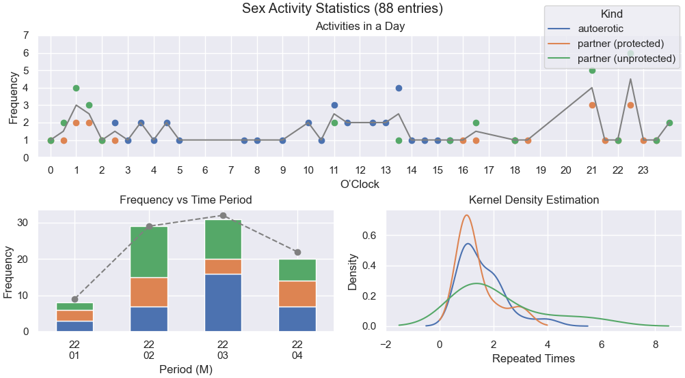
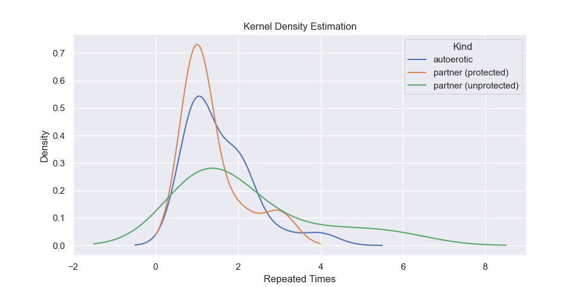

# Sex Activity Statistics
Analyze and visualize sex activity log data from Apple HealthKit.

## Shortcut
The Shortcut used to generate log data is [Log WooHoo](https://www.icloud.com/shortcuts/4409b2271c2b4ce7837ec0867c2e81e2).

<details>
<summary>Screenshot</summary>

</details>

It works on both iOS (iPhone) and WatchOS (Apple Watch). It is also proudly produced by myself.

## Script
The script is run by:

```
python sex_stats.py [-h] --file FILE (--chart CHART | --all)
```

N.B. Python >= 3.8 required, other dependencies are pandas, matplotlib, and seaborn.

## Showcase
Data is fake.

- All-in-one

by `python sex_stats.py -f FILE --all`.

- Individual charts
can be generated at once by `python sex_stats.py -f FILE --chart all`.



